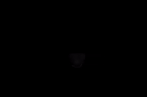

# LangFlip

LangFlip is a free, open-source macOS writing assistant for people who constantly
switch between languages. It fixes wrong-keyboard-layout text, corrects small
typing mistakes, polishes grammar, translates selected text, and can copy text
from a selected screen region.

The core layout fixer works locally with rules and dictionaries. The AI features
are optional and can run on-device through Ollama, with **Qwen 3.5 4B** as the
current default local model. The practical goal is simple: type naturally, make
fewer manual corrections, and spend less time cleaning up text in every app on
your Mac.

Supports **EN ↔ UK ↔ RU** out of the box.

> Repo / package / build directory is named `lang-flip` (kebab-case);
> the user-facing app is **LangFlip** (CamelCase). Bundle ID is
> `com.antonpinkevych.lang-flip`.

## Current state

LangFlip is already useful as a daily macOS menu-bar app:

- automatic wrong-layout correction works for English, Ukrainian, and Russian;
- selected text can be fixed with the keyboard instead of copy/paste gymnastics;
- Ollama integration works with local models, including Qwen 2.5 and Qwen 3.5;
- grammar correction can run on single Shift or after sentence-ending punctuation;
- screen text capture works with a vision-capable local model and copies OCR text
  to the clipboard;
- onboarding, Preferences, signing, DMG, notarization, and Sparkle update plumbing
  exist in the repo and are being polished for release.

The next product focus is first-session UX: clearer onboarding, cleaner menu
structure, better model/dictionary installation flows, and release packaging.

## Install

1. Download the latest **LangFlip-X.Y.Z.dmg** from
   [Releases](https://github.com/MikeKorotych/lang-flip/releases).
2. Open the DMG and drag **LangFlip** into your Applications folder.
3. Open LangFlip from Applications. The first launch shows a small wizard that walks
   you through granting two macOS permissions:
   - **Accessibility** — needed to read keystrokes globally
   - **Input Monitoring** — needed on macOS 10.15+

   Both buttons in the wizard deep-link straight to the right pane in System Settings.

That's it. After the wizard you'll see a small `⌥` icon in the menu bar.

> Releases are signed with a Developer ID and notarized by Apple, so Gatekeeper accepts
> them without the "unidentified developer" warning. If you build from source yourself,
> you'll get the warning until you sign the binary — see [Distribution](#distribution).

## Features

- **Auto-flip on word boundary.** Type `руддщ` on a Ukrainian layout when you
  meant `hello`, hit Space, and LangFlip rewrites it as `hello ` while switching
  the system input source back to ABC. The reverse direction works too.

- **Manual selection fix.** If a word, sentence, or paragraph was typed in the
  wrong layout, select it and use the configured hotkey. LangFlip copies the
  selection, converts it, pastes the fixed text, and restores your original
  clipboard.

- **Smart hotkeys** (à la Caramba):
  - **⇧⇧** flips the last word or selection;
  - **⇧⇧⇧** switches to a secondary language, or can be repurposed for AI fix;
  - **both ⇧ keys at once** pause or resume the whole app;
  - **⇧Space** can translate selected text;
  - **⇧⌘S** captures text from a selected screen region.

- **Local AI grammar correction.** With Ollama enabled, a single clean Shift tap
  can rewrite the selected text or the most recent sentence. LangFlip passes the
  current keyboard layout as context, so the model treats that layout as the
  intended output language instead of randomly translating your text.

- **Sentence-end auto-fix.** When enabled, typing `.`, `!`, or `?` sends the
  completed sentence through the selected AI model. The fix preserves the
  sentence boundary and any text you typed while the model was thinking.

- **Screen text capture.** With `qwen3.5:4b` or another vision-capable Ollama
  model, press **⇧⌘S**, select a region on screen, and LangFlip extracts visible
  text into the clipboard. This is useful for screenshots, images, video frames,
  app UIs, PDFs, or any text that is hard to select normally.

- **Translation.** Select text and translate it into English, Ukrainian, or
  Russian from the menu, or with the optional **⇧Space** hotkey.

- **Self-learning.** Got a flip you did not want? Hit Backspace and LangFlip both
  undoes it and remembers never to flip that exact word again. No exception list
  to manage by hand - one Backspace teaches it.

- **Sticky-shift fix.** `WOrld` → `World`, `ПРивет` → `Привет`. Only fires when the
  corrected form is a real dictionary word, so acronyms like `OAuth` stay intact.

- **Context-aware.** Auto-flip stays silent in terminals (Terminal, iTerm2, Warp,
  Ghostty, …) and password managers (1Password, LastPass, Bitwarden, …) — anywhere a
  bad rewrite would do real damage. Optional: pause in fullscreen apps (off by default).

- **Per-app override.** From the menubar, disable auto-flip in any specific app you don't
  want it touching.

- **Visual confirmation.** A bouncy 180° icon flip pops up at the bottom of the screen
  on every rewrite. Off by default; opt in via Preferences > Behavior.

- **Sound feedback.** Quiet system tick on every rewrite. Off by default.

- **Launch at login.** One toggle in Preferences.

- **Bundled UK / RU dictionaries.** Ukrainian and Russian dictionaries are built
  from frequency lists, cleaned for duplicates and cross-language contamination.
  English uses the system dictionary at `/usr/share/dict/words`.

## Why It Helps

LangFlip removes a surprisingly common tax from daily computer work:

- fewer layout-switching mistakes while typing in multiple languages;
- fewer copy/paste trips through browser-only tools like Grammarly;
- fast grammar cleanup in native macOS apps, chats, documents, IDE-adjacent
  writing, and office tools;
- local AI processing when using Ollama, so the text stays on your Mac;
- OCR for text that is visible but not selectable.

The app is especially useful for programmers, office workers, founders, support
teams, writers, and anyone who writes in more than one language all day.

## Local AI Setup

AI features are optional. The simplest local setup today is Ollama:

1. Install and open [Ollama](https://ollama.com/).
2. In LangFlip, open **Preferences → AI**.
3. Choose **Ollama (local)**.
4. Install or select **Qwen 3.5 4B** for grammar fixes and screen text capture.
5. Use the built-in grammar and OCR test buttons to confirm the model works.

LangFlip talks only to `127.0.0.1:11434` in Ollama mode. Text and screenshots are
sent to the local Ollama daemon on your Mac, not to LangFlip servers.

## Screens

The app is a menubar utility with a separate Preferences window and a small
onboarding wizard on first launch. Fresh screenshots and short demo GIFs are part
of the release polish pass.

Current visual asset:

<p align="center"></p>

## Project layout

```
Sources/LangFlip/
  LangFlipApp.swift         — @main App + AppDelegate
  MenubarController.swift   — NSStatusItem menu, translate, OCR, updates, Preferences
  OnboardingWindow.swift    — first-launch permissions wizard
  PreferencesWindow.swift   — Preferences window controller
  PreferencesView.swift     — SwiftUI preferences, model install/test UI, app settings
  Settings.swift            — UserDefaults toggles
  EventTap.swift            — CGEventTap, hotkeys, text rewrites, OCR trigger
  WordBuffer.swift          — current-word buffer
  SentenceBuffer.swift      — sentence tracking for AI grammar fixes
  Layouts.swift             — physical-key char maps + layout detection
  InputSource.swift         — TIS API wrapper (language-property based)
  AutoFlip.swift            — score / suggest flip + password entropy filter
  AppContext.swift          — context blacklist + fullscreen detection
  BackspaceLearner.swift    — undo + exception list state machine
  DoubleCapsFix.swift       — sticky-shift correction
  PermissionStatus.swift    — Accessibility, Input Monitoring, Screen Recording helpers
  LaunchAtLogin.swift       — SMAppService.mainApp wrapper
  Sound.swift               — NSSound feedback
  FlipOverlay.swift         — optional visual rewrite animation
  Pasteboard.swift          — capture + restore round-trip
  Notifications.swift       — internal NotificationCenter names
  AI/                       — Ollama, OpenAI-compatible, Apple Foundation adapters
  Dictionaries/             — bundled uk-words.txt + ru-words.txt
Resources/
  Info.plist                — bundle metadata, LSUIElement, version
  AppIcon.icns              — generated from lang-flip-logo.png
  AppIcon.iconset/          — source PNGs for AppIcon.icns
  lang-flip-logo.png        — 1024x1024 master icon
  lang-flip.entitlements    — hardened-runtime entitlements (intentionally empty)
Scripts/
  build-dicts.sh            — fetch + clean UK / RU frequency lists
  build-icon.sh             — master PNG → iconset → .icns
Makefile                    — build / sign / dmg / notarize / release
ROADMAP.md                  — future plans
```

## Build from source

```sh
make app                  # → build/LangFlip.app (ad-hoc signed, Gatekeeper will warn)
make run                  # signed install to /Applications + launch (same as make dev)
make dev                  # daily development loop; preserves the real TCC permission identity
make install              # copies build/LangFlip.app → /Applications/
make clean                # nuke .build and build/
```

Use `make dev` / `make run` for local testing. Launching the ad-hoc `build/` copy can
confuse macOS Accessibility / Input Monitoring permissions because TCC tracks the
installed signed app separately. For distribution, see below.

## Distribution

Each release goes through five stages, automated via `make release`:

```
make release
   ├── make build        # swift build -c release
   ├── make app          # assemble .app bundle (incl. dictionaries + icon)
   ├── make sign         # codesign with Developer ID Application + hardened runtime
   ├── make dmg          # create-dmg with drag-to-Applications layout
   └── make notarize     # xcrun notarytool submit + xcrun stapler staple
```

You can also run individual targets — they all `make app` first as a dependency, so
they're idempotent.

### One-time setup

You need an Apple Developer account ($99 / year) and one signing identity.

1. **Developer ID Application certificate.**
   At <https://developer.apple.com/account/resources/certificates/add>, pick
   **Developer ID Application**, follow the CSR flow, and double-click the downloaded
   `.cer` to install it. Verify with:
   ```sh
   security find-identity -v -p codesigning | grep "Developer ID Application"
   ```

2. **App-specific password** for notarytool.
   Go to <https://account.apple.com/account/manage> → App-Specific Passwords →
   Generate. Save the 4×4 password.

3. **Keychain profile** so notarytool doesn't prompt every release:
   ```sh
   xcrun notarytool store-credentials lang-flip-notarize \
       --apple-id   you@example.com \
       --team-id    YOURTEAMID \
       --password   xxxx-xxxx-xxxx-xxxx
   ```
   Find your Team ID at <https://developer.apple.com/account> → Membership.

After this you can ship a release with one command:

```sh
make release                              # build + sign + dmg + notarize + staple
gh release create v0.2.0 build/LangFlip-0.2.0.dmg
```

### Auto-update via Sparkle

Released builds carry the Sparkle framework, so once a user has installed any
v0.2.0+ they'll be offered new versions automatically. The maintainer flow per
release:

1. **One-time setup** — generate the EdDSA signing keypair (saved to your
   login keychain):
   ```sh
   .build/artifacts/sparkle/Sparkle/bin/generate_keys
   ```
   The printed `SUPublicEDKey` is already in `Resources/Info.plist`. Generate
   keys again only if you've lost the keychain entry — be aware that rotating
   the public key invalidates *all* previously-shipped binaries' update path.

2. **Enable GitHub Pages** for `main` branch, `/docs` folder
   (Settings → Pages). The appcast then lives at
   `https://mikekorotych.github.io/lang-flip/appcast.xml`, which is the
   `SUFeedURL` baked into Info.plist.

3. **Per release** — after `make release` produces a notarized DMG:
   ```sh
   make sign-update DMG=build/LangFlip-0.x.0.dmg
   # Prints: sparkle:edSignature="…" length="…"
   ```
   Open `docs/appcast.xml` and prepend a new `<item>` (template at the bottom
   of this section). Commit, push, then `gh release create` to publish the DMG.
   GitHub Pages picks up the new appcast within a minute.

4. **Verify** by mounting the DMG, copying `LangFlip.app` to `/Applications/`,
   launching, and clicking **Check for Updates…** in the menubar. Sparkle
   should report "you have the latest" if the appcast has no item newer than
   the running version.

`<item>` template (newest entry goes near the top of `<channel>`):

```xml
<item>
  <title>v0.x.0</title>
  <pubDate>Thu, 8 May 2026 12:00:00 +0000</pubDate>
  <sparkle:version>0.x.0</sparkle:version>
  <sparkle:shortVersionString>0.x.0</sparkle:shortVersionString>
  <sparkle:minimumSystemVersion>13.0</sparkle:minimumSystemVersion>
  <description><![CDATA[<h2>What's new</h2><ul><li>…</li></ul>]]></description>
  <enclosure
      url="https://github.com/MikeKorotych/lang-flip/releases/download/v0.x.0/LangFlip-0.x.0.dmg"
      length="…"
      type="application/octet-stream"
      sparkle:edSignature="…" />
</item>
```

### Without a Developer Account

You can still ship something. Skip `sign` / `notarize`, run only:

```sh
make dmg
```

Tell users on first launch to right-click → Open (Gatekeeper bypass for unsigned).
Useful for sharing with friends; not recommended for general distribution.

## Limitations

- Some apps (terminals, password fields, some IME-driven editors) reject synthesized
  unicode keystrokes — auto-flip stays silent there by default. Manual hotkey still
  works in most.
- Screen text capture needs macOS Screen Recording permission. The Preferences OCR
  test does not need that permission because it sends a generated test image directly
  to the model.
- Local AI quality and latency depend on the selected Ollama model and your Mac.
  Qwen 3.5 4B is the default because it is compact and supports the screen OCR path.
- If your installed input sources don't expose a primary language code (rare), the
  app may not recognize them. Edit `InputSource.swift` if you hit this.
- Backspace-learning is keyed on the lowercased word; case-sensitive jargon "Foo" and
  "foo" share an exception slot.

## Roadmap

See [ROADMAP.md](ROADMAP.md) for the long list. Highlights still ahead:

- Polish onboarding, menu structure, and the first-session AI setup flow
- Downloadable dictionary packs for more Slavic and European languages
- Customizable hotkeys for OCR, translation, grammar fixes, and layout flipping
- App Store feasibility investigation
- Anonymous opt-in telemetry to tune the dictionaries
- iCloud sync of settings + learned exception list

## License

MIT.
